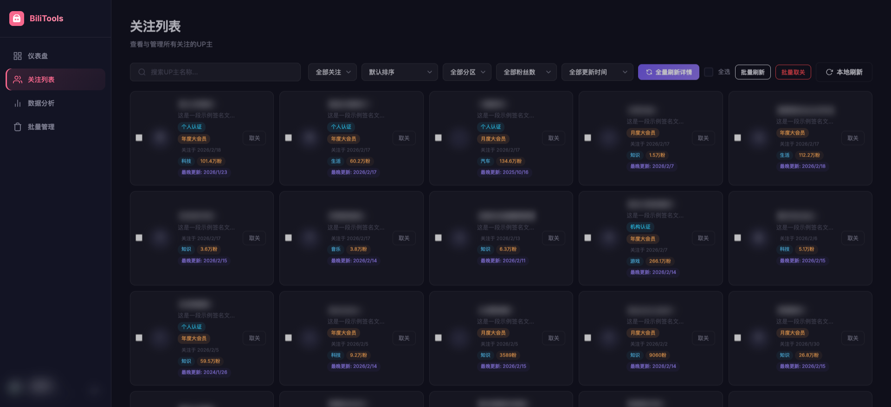
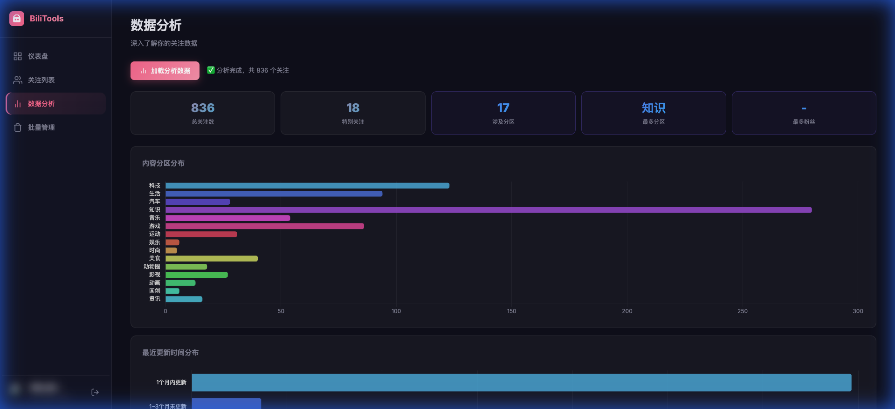

# 🎬 Bilibili Tools

> B站关注管理工具 —— 批量查看、筛选、取关你的关注列表，支持粉丝数/分区/更新时间等多维度分析。


---

## ✨ 功能特性

| 功能 | 说明 |
|------|------|
| 📋 **关注列表** | 展示全部关注，支持搜索、筛选、分页 |
| 🔍 **多维筛选** | 按互关/特别关注/认证/大会员/分区/粉丝数/更新时间筛选 |
| 📊 **数据分析** | 粉丝数分布、投稿分区分布、活跃度分析图表 |
| ✅ **多选批量操作** | Checkbox 多选，批量取关、批量刷新详情 |
| 🔄 **本地缓存** | 数据本地缓存，下次打开秒速加载 |
| 🌐 **从B站刷新** | 一键拉取所有关注的最新粉丝数和投稿分区 |
| 🗂️ **批量管理** | 高级筛选 + 批量取关，快速清理僵尸UP |

---

## 📸 截图预览

| 登录页 | 关注列表 |
|:------:|:-------:|
|  |  |

| 数据分析 |
|:-------:|
|  |

---


## 🚀 快速开始

### 方式一：直接运行（推荐）

**macOS：**
```bash
bash start.sh
```

**Windows：**
```
双击 start.bat
```

启动后浏览器会自动打开 `http://localhost:8000`。

---

### 方式二：手动运行

**环境要求：** Python 3.8+

```bash
# 1. 安装依赖
pip install -r requirements.txt

# 2. 启动服务（必须在 backend 目录下运行）
cd backend
python3 -m uvicorn main:app --host 0.0.0.0 --port 8000

# 3. 打开浏览器访问
open http://localhost:8000
```

---

## 📖 使用说明

### 第一步：扫码登录

打开页面后，点击左侧「**扫码登录**」，用 B站 App 扫描二维码完成登录。

### 第二步：加载关注列表

登录成功后，点击「**关注列表**」，系统会自动从本地缓存加载数据（首次使用会从B站拉取）。

### 第三步：加载详细数据（可选）

点击工具栏的「**从B站刷新**」按钮，系统会逐个拉取每位UP主的：
- 粉丝数
- 主投稿分区
- 最近更新时间

> ⚠️ 由于B站接口限速，全量刷新需要一定时间，关注人数越多耗时越长。

### 第四步：筛选与管理

**关注列表页：**
- 顶部下拉框可按类型、分区、粉丝数、更新时间筛选
- 勾选 Checkbox 多选，点击「**批量取关**」或「**批量刷新**」

**批量管理页：**
- 支持「详细数据为空」筛选，快速找出未采集数据的UP主
- 应用筛选后全选，一键批量取关

---

## 🗂️ 项目结构

```
bilibilitools/
├── backend/
│   ├── main.py          # FastAPI 后端主程序
│   └── bilibili_api.py  # B站 API 封装
├── frontend/
│   ├── index.html       # 主页面
│   ├── js/
│   │   ├── app.js       # 前端主逻辑
│   │   └── api.js       # API 请求封装
│   └── css/
│       └── style.css    # 样式
├── data/                # 本地缓存数据（自动生成）
├── start.sh             # macOS 启动脚本
├── start.bat            # Windows 启动脚本
├── build.sh             # macOS 打包脚本
├── build.bat            # Windows 打包脚本
├── build.spec           # PyInstaller 配置
└── requirements.txt     # Python 依赖
```

---

## 📦 打包为可执行文件

**macOS（生成 .app + .dmg）：**
```bash
bash build.sh
```

**Windows（生成 .exe）：**
```
双击 build.bat
```

打包产物在 `dist/` 目录下。

---

## ⚙️ 技术栈

- **后端：** Python 3 + FastAPI + uvicorn + httpx
- **前端：** 原生 HTML / CSS / JavaScript + Chart.js
- **打包：** PyInstaller

---

## ❓ 常见问题

**Q: 粉丝数显示为空？**  
A: 需要先点击「从B站刷新」加载详细数据。数据会缓存到本地，下次打开无需重新加载。

**Q: 刷新进度卡住不动？**  
A: 可能触发了B站接口限速，稍等片刻后进度会继续。也可以点「停止」后，用「批量管理」→「详细数据为空」筛选出未完成的UP主，再「批量刷新」。

**Q: 登录二维码过期？**  
A: 二维码有效期约3分钟，过期后刷新页面重新获取即可。

**Q: macOS 提示"无法打开，因为无法验证开发者"？**  
A: 在终端执行：
```bash
xattr -cr dist/BilibiliTools.app
```
然后右键 → 打开。

---

## 📄 License

MIT License
